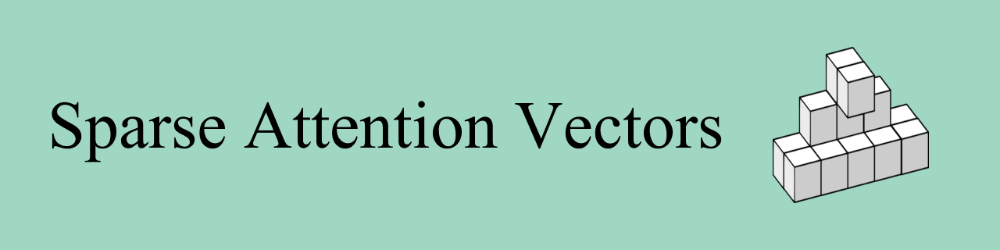

# Sparse Attention Vectors (SAVs)
---
*SAVs is an interpretable feature extraction method that enables state-of-the-art (SOTA) few-shot performance on a variety of discrete-label classification tasks: surpassing other few-shot and even LoRA-finetuned baselines.*


<p align="center">
  
  <br>
  <a href="https://chancharikmitra.github.io/SAVs_website/">Website</a> | <a href="https://arxiv.org/abs/2412.00142">Paper</a>
</p>

### 📰 News
- [01/13/2025] 🔥 SAVs codebase released publicly!


### Method Overview
---
<p align="center">
  
</p>


**Key Problem:**
- Large Multimodal Models (LMMs) excel at generative tasks but aren't directly suited for discriminative vision-language tasks (classification, multiple-choice VQA)
- Need better ways to extract useful features from these models for discrete label predictions

**Our Solution - SAVs:**
- A finetuning-free method that extracts sparse attention head activations from LMMs
- Uses less than 1% of attention heads as features

**Key Benefits:**
- Works with any discriminative vision-language task requiring discrete labels
- Achieves SOTA performance with just few-shot examples
- Outperforms both few-shot and finetuned baselines (including LoRA)
- Scales well with additional examples
- Generalizes effectively to similar tasks
- Requires no model finetuning
- Creates robust, truly **multimodal** feature representations
  <p align="center">
    <table>
      <tr>
       <th></th>
       <th>CLIP</th>
       <th>SigLIP</th>
       <th style="border-left: 2px solid black; border-right: 2px solid black;"><b>SAVs</b></th>
      </tr>
      <tr>
       <td>Image Input</td>
       <td>✓</td>
       <td>✓</td>
       <td style="border-left: 2px solid black; border-right: 2px solid black;">✓</td>
      </tr>
      <tr>
       <td>Text Input</td>
       <td>✓</td>
       <td>✓</td>
       <td style="border-left: 2px solid black; border-right: 2px solid black;">✓</td>
      </tr>
      <tr>
       <td>Interleaved Input</td>
       <td>✗</td>
       <td>✗</td>
       <td style="border-left: 2px solid black; border-right: 2px solid black;">✓</td>
      </tr>
    </table>
  </p>

For more information, please refer to our [paper](https://arxiv.org/abs/2412.00142)!

### 💻 Setup
---
To get started, first clone our repo and set up the environment:

```bash
git clone https://github.com/chancharikmitra/SAVs.git
cd SAVs

conda create -n savs python=3.10 -y
conda activate savs
pip install -e .
```

#### Running SAVs

We have provided a simple script `run.py` that both extracts SAVs using the `mllm_encode` method and then applies SAVs to a provided test dataset using `mllm_classify`. The outputs of `mllm_encode` are given as a dictionary with the following fields:

1. 'activations' - a PyTorch tensor of size `[num_classes, num_heads, head_dim]`
2. 'top_heads' - a list with tuples that give the indices of the top heads as `(layer_idx, head_idx, optional_head_tag)`
3. 'int_to_str' - a dictionary mapping of integers to string names of the class labels (e.g. `{0 : 'cat', 1 : 'dog'}`) for indexing the activations

While we use these activation vectors for discrete-label or discriminative VL tasks, we encourage you to find other uses for these features!

To run SAVs, use the following command:

```python 
python3 -m src.run \
    --model_name model_name \
    --data_name dataset_name \
    --train_path /path/to/train.json \
    --val_path /path/to/test.json
```

#### Models
Our codebase has two SOTA models set up by default: LLaVA-OneVision-7B ('llava_ov') and Qwen2-VL ('qwen2_vl'). Adding a model is very easy. Simply follow the `ModelHelper` class template in `models.py`.

#### Datasets
Our method can be applied to any discriminative, discrete-label VL task. We provide a variety of examples on how to format datasets (found in the `data` folder). Adding a new dataset is simple:

1. Format a training and test set as shown in our examples. If we already provide the training set (and the number of examples suits your use), format the test set identically.
2. Add the respective formatting function in `preprocess.py`. Use the given examples for reference. Note: it may be necessary to change the image file paths (either in the files or `preprocess.py`.

You may choose to change the default number of examples and heads used. But we find 20 examples and 20 heads is enough to yield state-of-the-art performance on a variety of VL tasks: **outperforming even LoRA at this sample complexity!**

Note regarding evaluation: Most datasets will be fine with raw accuracy scoring as implemented in `run.py`, but some benchmarks like NaturalBench may require alternative scoring (e.g. `run_natural_ret.py`) and yet other benchmarks like BLINK are such that SAVs are extracted for each subtask/split. We have ensured that the code is flexible enough to be easily adapted to a wide variety of benchmarks styles.

Other Notes:
 - NaturalBench Images can be downloaded at the following [link](https://huggingface.co/datasets/BaiqiL/naturalbench_pictures/blob/main/raw_images.zip)

### 📝 Citation
---
If you found our work useful, please consider starring and citing. Thank you!
```latex
@article{mitra2024sparse,
  title={Sparse Attention Vectors: Generative Multimodal Model Features Are Discriminative Vision-Language Classifiers},
  author={Mitra, Chancharik and Huang, Brandon and Chai, Tianning and Lin, Zhiqiu and Arbelle, Assaf and Feris, Rogerio and Karlinsky, Leonid and Darrell, Trevor and Ramanan, Deva and Herzig, Roei},
  journal={arXiv preprint arXiv:2412.00142},
  year={2024}
}
```
